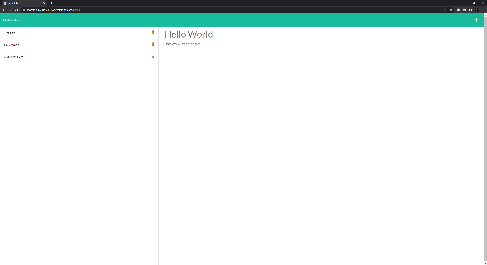
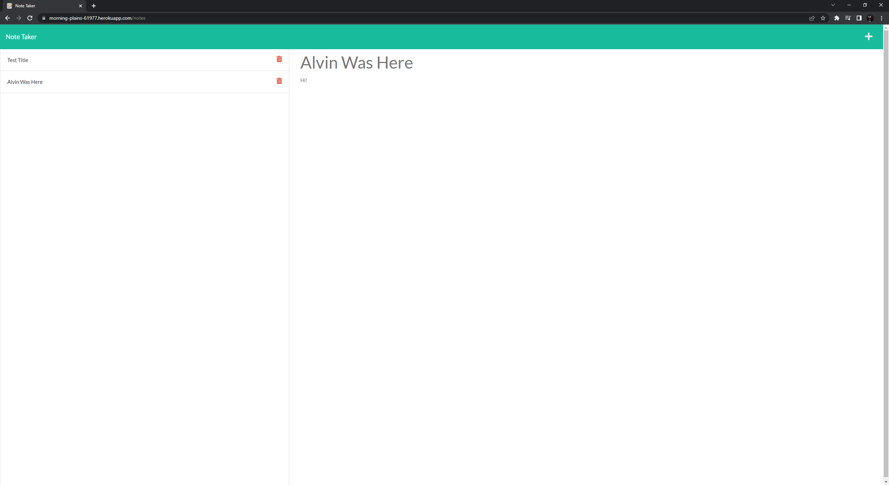

# Super Note Taker

This was the Ninth challenge assignment for our UPENN Bootcamp. We were tasked with creating an Express app that retains notes that you create and can be accessed from any where via a Heroku Deployment. (See **User Story** and **Acceptable Criteria** sections below).

---

## 📕 User Story 

AS A small business owner I WANT to be able to write and save notes SO THAT I can organize my thoughts and keep track of tasks I need to complete

---

## ✔️ Acceptable Criteria 

- GIVEN a note-taking application
- WHEN I open the Note Taker THEN I am presented with a landing page with a link to a notes page
- WHEN I click on the link to the notes page THEN I am presented with a page with existing notes listed in the left-hand column, plus empty fields to enter a new note title and the note’s text in the right-hand column
- WHEN I enter a new note title and the note’s text THEN a Save icon appears in the navigation at the top of the page
- WHEN I click on the Save icon THEN the new note I have entered is saved and appears in the left-hand column with the other existing notes
- WHEN I click on an existing note in the list in the left-hand column THEN that note appears in the right-hand column
- WHEN I click on the Write icon in the navigation at the top of the page THEN I am presented with empty fields to enter a new note title and the note’s text in the right-hand column

---

## 🔧 Optimizations 

### Javascript
- Allows user to write, store, retrieve and delete notes
- Uses the Express npm module
- Uses UUID npm module to generate unique ids for each note
- Is deployed to Heroku so user can access it on the web where ever they are

---

## 📷 Screenshots 

---

## 🎯 Deployment

Repository: https://github.com/alvinkp/SuperNoteTaker

Heroku Deployment: https://drive.google.com/file/d/1l87W4yQzagW4urRg8o649gaRX-U0Sgbc/view

---

## ✉️ Authors 

- [@alvinkp](https://www.github.com/alvinkp)